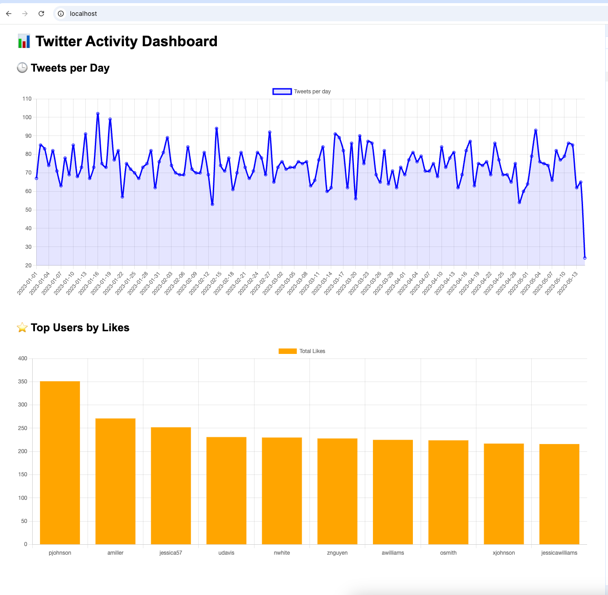

**DATA1500 Assignment 12: NoSQL + Fullstack Twitter Dashboard**

---

**Objective**
The goal of this assignment was to design and implement a NoSQL-based solution using MongoDB to store and analyze data from a social media platform (Twitter). 
I built a fullstack application using:

- MongoDB (NoSQL DB)
- Java Spring Boot (Backend with REST API)
- Chart.js + HTML (Frontend visualizations)
- NGINX (Reverse proxy)
- Docker Compose (to tie everything together)

---

**Document Model**
```json
{
  "Tweet_ID": 1,
  "Username": "julie81",
  "Text": "...",
  "Retweets": 2,
  "Likes": 25,
  "Timestamp": "xxxx"
}
```
No separate collections were needed for users or likes in this case, because tweets already include the required metadata.

---

**Why MongoDB?**
- Tweets are semi-structured documents → ideal for document-based storage
- Schema flexibility (fields like hashtags or replies could vary per tweet)
- Built-in aggregation framework allows efficient trend analysis
- No need for SQL joins or normalization in this use case

---

**Relational vs. NoSQL Comparison**
| Feature               | SQL (e.g., MariaDB)                   | NoSQL (MongoDB)                         |
|-----------------------|-------------------------------------- |-----------------------------------------|
| Data Model            | Tables, rows, joins                   | Documents (BSON/JSON)                   |
| Schema                | Fixed (ALTER TABLE to change)         | Flexible (schema-less)                  |
| Relationships         | Normalized, JOINs                     | Embedded or referenced                  |
| Performance for reads | Slower with joins                     | Fast aggregations, no joins             |
| Good for analytics?   | Yes, but more setup                   | Yes, with built-in aggregation pipeline |

---

**Features Implemented**
- `/api/stats/activity` → Number of tweets per day
- `/api/stats/top-users` → Most liked users
- `/api/stats/test-one` → JSON test of one tweet

---

**Frontend Preview**
Using Chart.js with fetch() and dynamic rendering.
- Tweets per day → Line chart
- Top users by likes → Bar chart

_Screenshot:_


---

**Docker Compose Setup**
Includes 3 services:
- `mongo` → MongoDB database
- `backend` → Spring Boot app on port 8090
- `frontend` → NGINX serving `index.html` and proxying `/api/*`

---

**🎓 What I Learned**
- How to model real-world semi-structured data in MongoDB
- Use MongoDB aggregations for analysis
- Build and expose Spring Boot REST APIs
- Visualize data with Chart.js and frontend JavaScript
- Dockerize a fullstack system and debug service interconnections

---

**Repository Structure (suggested GitHub layout)**
```
twitter-dashboard/
├── backend/             # Spring Boot app
├── frontend/            # index.html + Chart.js
├── nginx/               # nginx.conf reverse proxy config
├── docker-compose.yml   # fullstack orchestration
└── README.md            # summary & setup instructions
```

---

**How to run**
```bash
docker compose up --build
```
Visit:
- `http://localhost` → Dashboard
- `http://localhost/api/stats/activity` → API JSON
```

---

**Thank you!**

